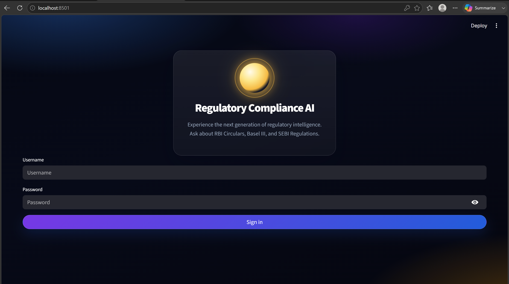
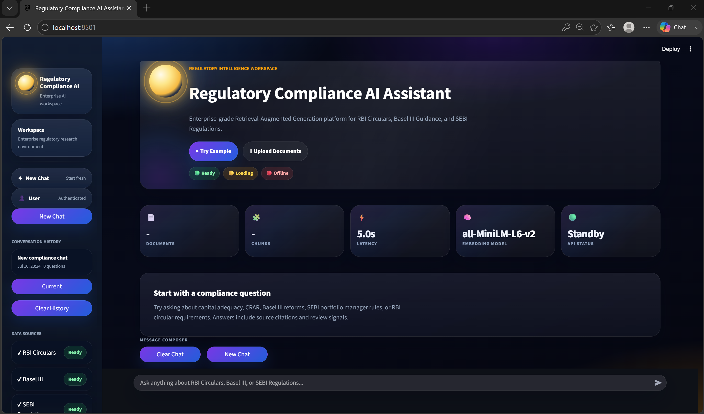
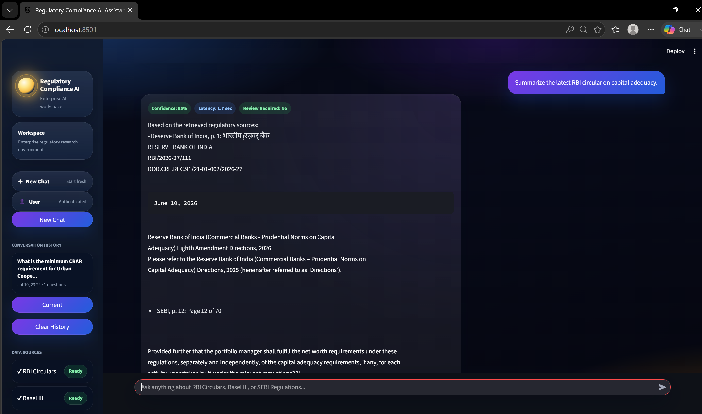
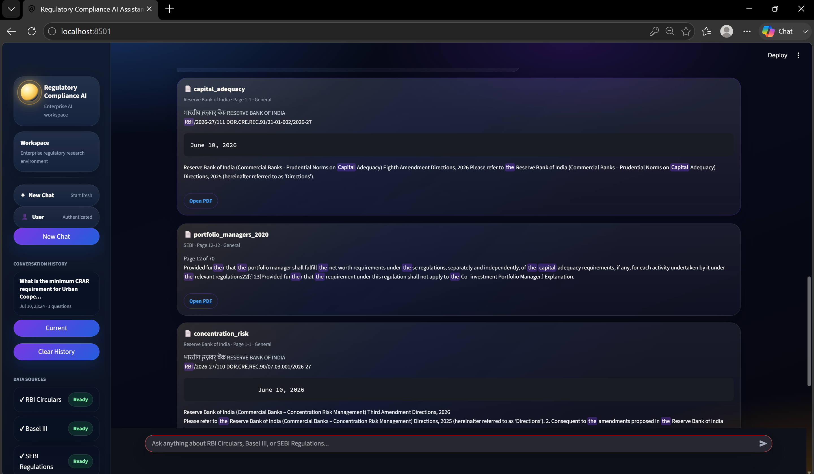
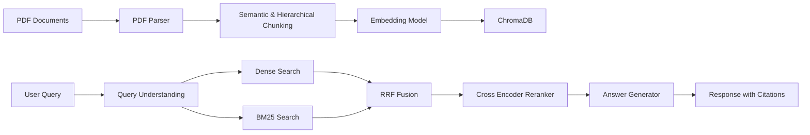

# 🏛️ Regulatory Compliance RAG Assistant


An **Enterprise Retrieval-Augmented Generation (RAG)** system designed for regulatory compliance teams to search and analyze **RBI Circulars**, **Basel III Guidance**, and **SEBI Regulations** with grounded answers and source citations.

---

# 📸 Application Screenshots

> Create a folder named **screenshots/** and place your images inside it.

## Login Screen



---

## Dashboard



---

## AI Response



---

## Source Citations



---

# 🚀 Project Highlights

✅ Hybrid Retrieval (Dense Vector Search + BM25)

✅ Reciprocal Rank Fusion (RRF)

✅ Cross Encoder Re-ranking

✅ Confidence-based Answers

✅ Explicit "I Don't Know" Responses

✅ Source Citation with Page Numbers

✅ Multi-document Comparison

✅ Semantic & Hierarchical Chunking

✅ FastAPI REST API

✅ Streamlit Enterprise Dashboard

✅ Authentication

✅ SQLite Audit Logs

✅ Docker Deployment

✅ Real-time PDF Ingestion

---

# 🛠 Tech Stack

| Category | Technologies |
|----------|--------------|
| Language | Python |
| Backend | FastAPI |
| Frontend | Streamlit |
| Vector Database | ChromaDB |
| Embeddings | Sentence Transformers |
| Retrieval | BM25 |
| Re-ranking | Cross Encoder |
| Storage | SQLite |
| Deployment | Docker |
| Version Control | Git & GitHub |

---

# 🏗️ Architecture



---

## Architecture Workflow

```
                  Regulatory PDFs
                         │
                         ▼
                  PDF Parsing
                         │
                         ▼
            Semantic Chunk Generation
                         │
                         ▼
             Metadata Enrichment
                         │
                         ▼
          Sentence Embedding Model
                         │
                         ▼
                  ChromaDB Storage
                         │
         ┌───────────────┴───────────────┐
         ▼                               ▼
   Dense Retrieval                 BM25 Retrieval
         │                               │
         └───────────┬───────────────────┘
                     ▼
         Reciprocal Rank Fusion
                     ▼
          Cross Encoder Re-ranking
                     ▼
          Citation Grounded Answer
                     ▼
            Streamlit / FastAPI
```

---

# ✨ Implemented Features

## Intelligent Question Answering

- Confidence Score
- Explicit "I don't know" responses
- Hallucination reduction

---

## Hybrid Retrieval

- Dense Vector Search
- BM25 Keyword Search
- Reciprocal Rank Fusion (RRF)

---

## Advanced Re-ranking

- Cross Encoder Re-ranking
- Improved retrieval relevance
- Better document ordering

---

## Citation Support

Each answer includes:

- Document Name
- Organization
- Page Numbers
- Section
- Highlight
- Excerpt
- Download Link

---

## Document Processing

- PDF Parsing
- Semantic Chunking
- Hierarchical Chunking
- Metadata Extraction

---

## Multi-document Comparison

Compare regulations across:

- RBI
- Basel III
- SEBI

---

## Monitoring & Evaluation

- Daily Evaluation
- RAGAS-style Metrics
- SQLite Dashboard
- Query Audit Logs

---

## Enterprise Features

- Authentication
- API Keys
- Rate Limiting
- Swagger Documentation
- Docker Deployment

---

# 📂 Project Structure

```
RAG_product
│
├── app
│   ├── api
│   ├── core
│   ├── ingestion
│   ├── retrieval
│   ├── evaluation
│   └── ui
│
├── data
│   ├── raw
│   └── processed
│
├── storage
│   ├── chroma
│   └── logs
│
├── tests
│
├── screenshots
│
├── Dockerfile
├── docker-compose.yml
├── requirements.txt
└── README.md
```

---

# ⚡ Quick Start

## 1 Clone Repository

```bash
git clone https://github.com/<your-username>/regulatory-compliance-rag.git

cd regulatory-compliance-rag
```

---

## 2 Install Dependencies

```bash
pip install -r requirements.txt
```

---

## 3 Configure Environment

```bash
cp .env.example .env
```

Update the values inside `.env`.

---

## 4 Start FastAPI

```bash
python -m app.main api
```

---

## 5 Ingest Regulatory PDFs

```bash
curl -X POST \
"http://localhost:8000/ingest?root_dir=./data/raw" \
-H "Authorization: Bearer change-me"
```

---

## 6 Start Streamlit UI

```bash
streamlit run app/ui/streamlit_app.py
```

---

## 7 Start Evaluation Dashboard

```bash
streamlit run app/ui/dashboard.py --server.port 8502
```

---

# 🔍 Example Query

Request

```json
{
  "question":"What CRAR percentage must urban cooperative banks maintain?",
  "max_sources":5,
  "include_excerpts":true
}
```

---

Response

```json
{
  "answer":"Urban cooperative banks shall maintain...",
  "confidence":0.92,
  "latency_ms":1200,
  "status":"ok",
  "review_flag":false,
  "sources":[
    {
      "document":"RBI Circular 1452",
      "organization":"Reserve Bank of India",
      "page":"8-10",
      "section":"Section 2.2 Cooperative Banks"
    }
  ]
}
```

---

# 🌐 REST API

## POST /query

Query the RAG system.

---

## POST /ingest

Index new regulatory PDFs.

---

## Swagger UI

```
http://localhost:8000/docs
```

---

# 📊 Evaluation

Run evaluation

```bash
python -m app.main evaluate \
--path ./data/processed/benchmark_test_questions.json
```

Run Scheduler

```bash
python -m app.main schedule
```

---

# 📁 Auto Document Watcher

Automatically indexes newly added PDFs.

```bash
python -m app.main watch \
--path ./data/raw
```

---

# 🐳 Docker Deployment

```bash
docker-compose up --build
```

Services

| Service | URL |
|----------|-----|
| FastAPI | http://localhost:8000/docs |
| Streamlit UI | http://localhost:8501 |
| Dashboard | http://localhost:8502 |

---

# 🧪 Testing

Run all tests

```bash
pytest -q
```

Example

```
11 tests passed
```

---

# 📈 Results

- Successfully indexed regulatory PDFs
- Hybrid Retrieval improved search relevance
- Confidence-based answers
- Citation-grounded responses
- Fast document ingestion
- Enterprise-ready dashboard

---

# 🎥 Demo

Demo video coming soon.

---

# 🔮 Future Improvements

- OpenAI / Azure OpenAI Integration
- Local LLM Support (Llama, Mistral)
- OCR for Scanned PDFs
- Multi-language Retrieval
- User & Role Management
- Feedback Learning
- Cloud Deployment (AWS / Azure / GCP)
- Analytics Dashboard
- PDF Annotation
- Chat History Export

---

# 👨‍💻 Author

**Manjunath K Byadagi**

Computer Science Engineering Student

PES University

GitHub: https://github.com/ManjunathByadagi

LinkedIn: www.linkedin.com/in/manjunath-k-byadagi

---

# ⭐ Support

If you found this project useful, please consider giving it a ⭐ on GitHub.